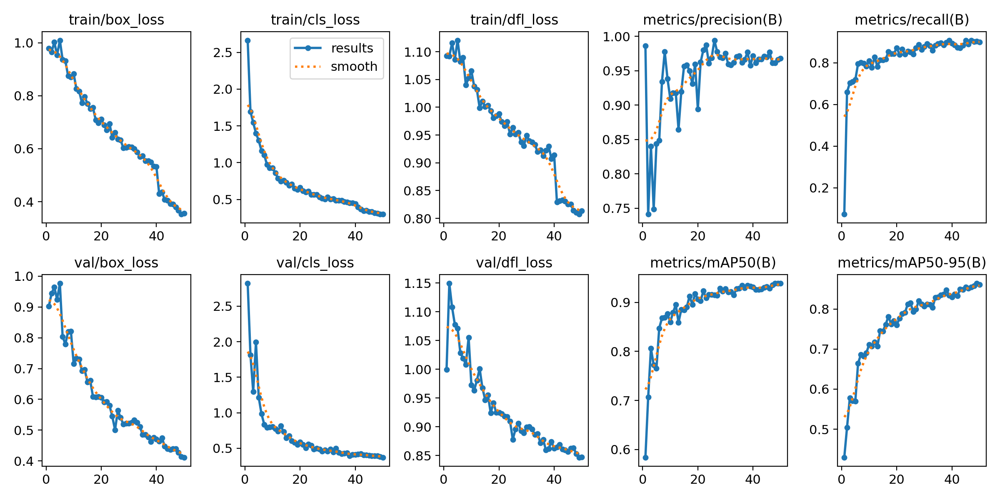
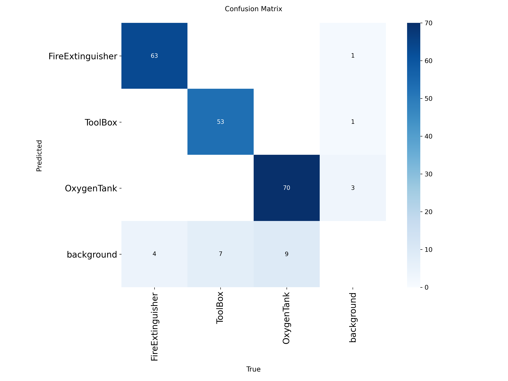
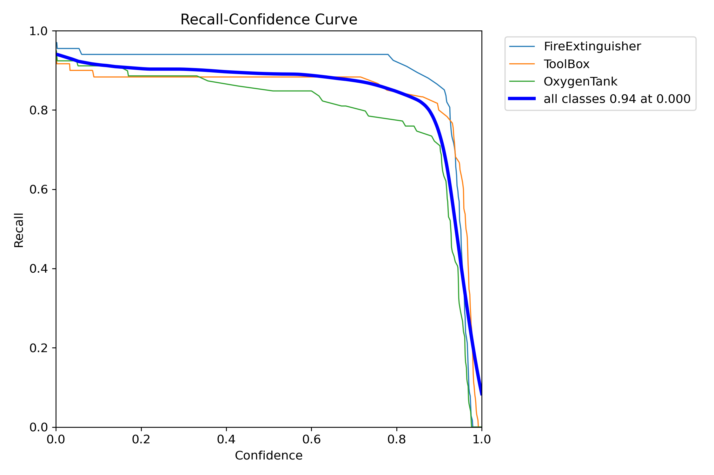

# 🚀 AstroDetect  
**“Detecting the Essentials, Protecting the Astronauts”**  

AstroDetect is an AI-powered object detection system built using **YOLOv8** to enhance astronaut safety in space stations.  
The model detects **Fire Extinguishers, Toolboxes, and Oxygen Tanks** with high accuracy, ensuring quick access to mission-critical equipment during emergencies.  

## 📌 Problem Statement  
In space stations, quickly locating critical tools is challenging due to **zero gravity, cluttered environments, and poor visibility**.  
Delays in detection can risk astronaut safety.  
👉 AstroDetect provides an **automated, real-time detection system** to solve this problem.  

## 📂 Dataset  
- Dataset provided by **Falcon (Hackathon dataset)**  
- 3 balanced classes:  
  - Fire Extinguisher (385 images)  
  - Toolbox (381 images)  
  - Oxygen Tank (373 images)  
- YOLO format annotations  

📑 **Config file:** [config.yaml](config.yaml)  
📦 **Dataset link:** [Download Here](https://storage.googleapis.com/duality-public-share/Datasets/Hackathon_Dataset.zip)

## ⚙️ Methodology  
- **Model:** YOLOv8  
- **Training:** Google Colab (GPU)  
- **Augmentations:** Rotation, scaling, brightness adjustments  
- **Evaluation Metrics:** mAP@0.5, Precision, Recall  
- **Deployment:** Hugging Face Spaces (Gradio app)  

📓 Training Notebook: [Open in Colab]([https://colab.research.google.com/drive/1HiH7Mcm8tQqGqDmbJhLaFZ3Sbj857pRP])  

## 📊 Results & Metrics  

| Metric     | Score |
|------------|-------|
| mAP@0.5    | XX %  |
| Precision  | XX %  |
| Recall     | XX %  |

**Training Curves**  
  

**Confusion Matrix**  
  

**Precision–Recall Curve**  
  

## 💡 Challenges & Solutions  

**Challenges**  
- Lighting variations in dataset  
- Occlusion and clutter  
- Limited dataset size  
- Limited compute resources  

**Solutions**  
- Applied data augmentation  
- Optimized hyperparameters  
- Used Colab GPU for training  
- Deployed model on Hugging Face Spaces  

## 🌐 Live Demo  
Try the app here 👉 [AstroDetect on Hugging Face](https://huggingface.co/spaces/hima1611/space_station_detection)  

## 🔮 Future Work & Conclusion  
**Future Work**  
- Expand dataset with more images  
- Enable **real-time video detection**  
- Deploy on **edge devices**  
- Integrate with astronaut alert systems  

**Conclusion**  
AstroDetect proves that AI-powered object detection can significantly improve astronaut safety by quickly identifying essential tools in space environments.  

